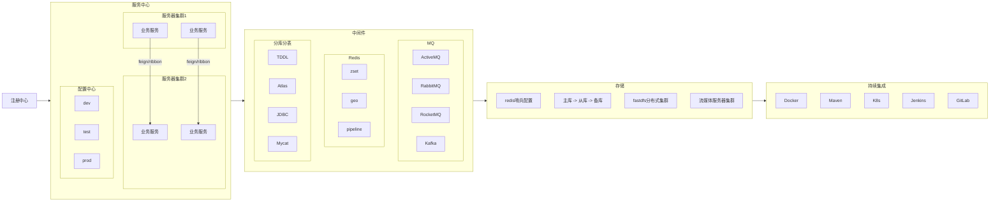

# Topology Rules

本文件承载 `SKILL.md` 中不适合长期占据主流程的详细规则。主流程只保留入口和硬约束；涉及架构大节点、布局、撤销历史、导出一致性、微服务参考形态时，读取本文件。

## Iteration Fixes

这些问题来自模板迭代中的真实反馈，后续生成或修改模板时必须纳入实现和验收：

1. **架构分区必须是真节点**：架构框不能作为网页背景、CSS 背景或画布外装饰存在，必须是 LogicFlow 图数据里的 `group-node` 大节点。它要能被选中、拖动、缩放，能进入 JSON，能跟随缩放，并且必须随导出图片一起出现。
2. **架构大节点是底层容器**：架构大节点要放在底层，但不能盖住箭头和标签。推荐层级为：架构大节点 `zIndex = 0`，箭头和边标签 `zIndex = 100`，普通节点 `zIndex = 200`。不要使用负数层级，避免导出或历史恢复时出现不一致。
3. **架构大节点不能重叠**：拉大某个架构容器后，必须重新检查所有容器边界。服务中心、中间件、存储、CI/CD、外部系统等大节点之间要留出明确间距，不能只调整普通节点而忘记同步调整容器。
4. **普通节点必须被容器完整包含**：普通节点不能超出所属架构大节点，例如 CI/CD 节点不能越过 CI/CD 容器边框。调整普通节点排版后，必须同步复查容器尺寸、标题位置和容器之间的间距。
5. **容器标题固定顶部居中**：架构大节点标题放在容器顶部居中，不能压住内部节点，不能跑到边框外，也不能放在左上角造成汇报图观感混乱。
6. **箭头标签避让优先**：边标签不能和水平箭头重叠，不能被节点压住，不能贴着节点边缘。水平箭头的标签优先放在线段上方或下方，必要时用 `text: { value, x, y }` 显式指定坐标，并开启边标签拖拽。
7. **编辑数据实时同步，但保留源数据**：网页中拖动节点、缩放架构框、移动边标签、编辑属性后，当前 Graph JSON 必须同步更新；同时要保留初始化源图数据用于重置，不能让页面编辑覆盖 reset 的基准。
8. **撤销/重做使用 LogicFlow 自带 history**：不要再做顶部自定义“上一步 / 下一步”按钮。撤销/重做由 LogicFlow 画布控制条承担，并且执行后要同步 Graph JSON。
9. **禁止在 history 回调里改图**：`history:change` 只能同步状态或 JSON，不能调用 `setElementZIndex`、`render`、`setProperties` 等会改图的 API，否则会产生新的历史记录，导致“上一步”无限可点，或撤销后架构大节点重新盖住箭头标签。
10. **初始加载不能有可撤销步骤**：模板刚加载完成时，理论上没有任何用户操作，所以 LogicFlow 的“上一步”必须是不可用状态。初始化渲染、图层校正、控件挂载完成后，要把当前图重置为 history 的唯一基线。
11. **导出必须等同当前画布**：导出图片必须来自当前 LogicFlow 图，而不是旧数据或 DOM 背景。导出结果要和网页当前看到的一致，包含架构大节点、普通节点、箭头、标签，并且不能出现节点重叠或标签遮挡。
12. **做完数据后必须检查节点问题**：完成 `src/data/flowTemplate.js` 后必须检查重复 id、悬空边、容器重叠、节点越界、普通节点重叠、标签遮挡、导出一致性和初始 history 状态。发现问题先修数据坐标、容器尺寸、标签位置和层级，再汇报。

## Data And Layout Rules

写完 `src/data/flowTemplate.js` 后必须按这些规则检查：

- 架构分区不能是 HTML/CSS 背景，必须是 LogicFlow 内部的 `group-node` 大节点。它要进入 JSON、跟随缩放、可选中调整，并随导出图片一起导出。
- `group-node` 必须作为底层容器节点：`properties.role = 'topology-group'`，稳定 id，`zIndex` 低于普通节点；普通服务、存储、中间件、CI/CD 节点在其上方。
- 架构大节点标题必须位于容器顶部居中。不要把标题随意放在左上角、边框外或与内部节点重叠。
- 每个普通节点必须落在对应 `properties.group` 的架构大节点边界内，并保留可读边距。
- 架构大节点之间不能互相重叠。服务中心、中间件、存储、CI/CD、外部系统等容器边界要留出清晰间距。
- 普通节点之间不能重叠或贴得过近。注册中心、配置中心、网关、业务服务等控制面/业务面节点要分层摆放，避免相互遮挡。
- 箭头标签不能直接压在水平箭头或节点上。必要时用 `text: { value, x, y }` 显式放置标签，并开启/保留边标签拖拽能力。
- 标签和箭头要可读：标签建议偏离线段上/下方，并使用白底、描边或等效样式避免被线条穿过。
- 拉开普通节点后，必须同步调整架构大节点尺寸和位置；调整架构大节点后，也必须复查它们之间是否重叠。
- 上述检查未通过时，先修 `src/data/flowTemplate.js`，再汇报。不能只说“用户可以手动调整”。

## Layout Rules

- 少于 12 个节点：优先**结构拓扑 + 少量关键箭头**，保持一屏读完。
- 12-40 个节点：按**架构域**分组，例如服务中心、中间件、存储、持续集成。
- 超过 40 个节点：先做**总览拓扑图**；细节放到 `note`，必要时拆成多张图：总览图、服务调用图、数据流图、部署图。
- 系统/服务节点用 `rect`，判断/网关/路由条件可用 `diamond`，开始/结束或外部入口可用 `circle`。
- 架构分区用 `group-node` 大节点，不用 DOM 背景、CSS 背景图或画布外层装饰模拟分区。
- `group-node` 标题顶部居中，容器放在底层，且容器之间不能重叠。
- 业务节点、控制面节点、中间件节点、存储节点之间要有足够间距；不同层级之间优先用横向/纵向分层，而不是堆在同一点附近。
- 边标签必须表达关系：`feign/ribbon`、`注册`、`配置拉取`、`publish`、`consume`、`读写`、`主从复制`、`部署发布`、`失败重试` 等。
- 边标签必须避开箭头和节点。水平箭头尤其容易压住标签，默认应把标签放到线段上方或下方；密集区域允许把标签拖离中点。
- 不把大段解释塞进节点文字；节点文字短，技术细节和业务含义放右侧属性面板。
- **结构层级优先**：先让读者看懂有哪些系统和组件，再用箭头说明它们如何协作。
- **业务箭头克制**：没有业务材料时不强行补业务链路；有业务材料时只标关键链路，避免满屏交叉线。

## Required Node Review

数据和页面完成后，至少做一次**节点问题复查**：

1. 容器检查：所有 `topology-group` 大节点互不重叠，内部组件没有越界。
2. 节点检查：普通节点不重叠、不贴边、不压住容器标题。
3. 标签检查：边标签不被箭头穿过，不贴住节点，不和其他标签重叠。
4. 缩放/导出检查：架构大节点、普通节点、箭头、标签都属于 LogicFlow 图数据，缩放和导出表现一致。
5. 编辑同步检查：网页里拖动节点、缩放架构框、移动边标签后，当前 Graph JSON / `getGraphData()` 必须同步更新。
6. 源数据检查：必须保留初始源图数据用于“重置”，不能让网页编辑覆盖 reset 的基准数据。
7. 历史检查：“上一步 / 下一步”必须接入 LogicFlow history，并在执行后同步 Graph JSON。
8. 导出检查：导出图片必须来自当前 LogicFlow 图，且与画布当前图形一致；不能缺少架构大节点，不能导出旧坐标、旧标签或重叠版本。
9. 图层历史检查：不要在 `history:change` 里调用 `setElementZIndex`、`render`、`setProperties` 等会改图的 API；否则撤销/重做会继续写入历史，造成“上一步”无限可点，或让架构大节点重新盖住箭头标签。
10. 初始历史检查：模板刚加载完成时不能有可撤销步骤；初始化渲染、图层校正、控件挂载完成后，必须把当前图重置为 history 唯一基线。
11. 修复闭环：发现问题先改 `src/data/flowTemplate.js` 的坐标、尺寸、标签位置、层级或样式，再继续验收/汇报。

## Visual Rules

- 汇报型：克制色彩、清晰分组、标题正式。
- 微服务型：突出服务中心、注册/配置中心、中间件、存储、CI/CD。
- 研发型：突出模块边界、调用链、数据流和异常路径。
- 运维型：突出集群、环境、实例、发布链路和故障回退。
- 避免无意义装饰，不用与流程无关的插画、emoji 或过度渐变。

## Microservice Reference Shape

当用户没有给具体项目，只给“微服务架构”这类抽象主题时，可以参考下面的**结构拓扑**，但必须标注为**通用示例 / placeholder**，不要伪装成用户真实系统：

这类图只有**架构结构**和**技术依赖**。实际项目中必须继续分析业务链路，例如“下单请求 -> 订单服务 -> 库存服务 -> MQ -> 支付服务 -> MySQL/Redis”，并把这些逻辑用**箭头标签**叠加到拓扑图上。
